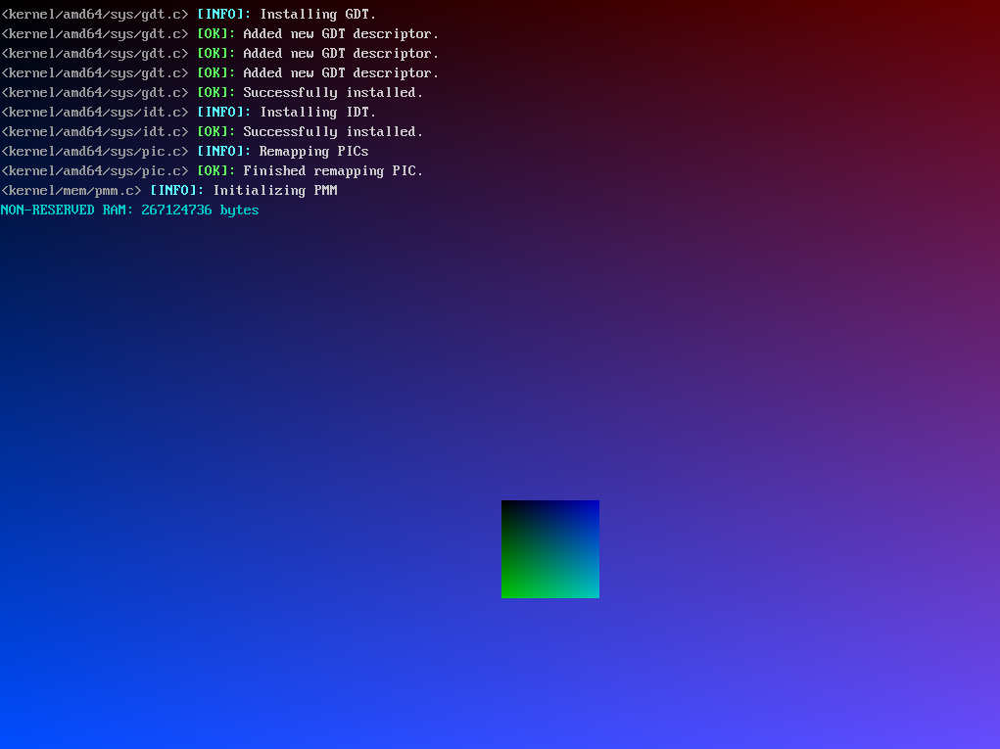

# fnix

NOTE: this is my first ever operating system. 

Currently, it has:

	- GDT
	- IDT
	- PIC
	- EXCEPTIONS

Plans:

	- PMM
	- VMM
	- Scheduler
	- Syscalls
	- Lapic
	- Multitasking
	- DOOM!!!!!

 

| HEADS UP | I have not included a cross-compiler yet. |
| ----------- | ----------- |

Credits to the creators of limine for making this all possible. Thank you :)

# screenshots:

